### Hardware requirements:

* Zalmotek’s RZ/A3M Feather SoM  
* USB-C cable  
* J-Link debugger

### Software requirements:

* Renesas e² studio IDE

# 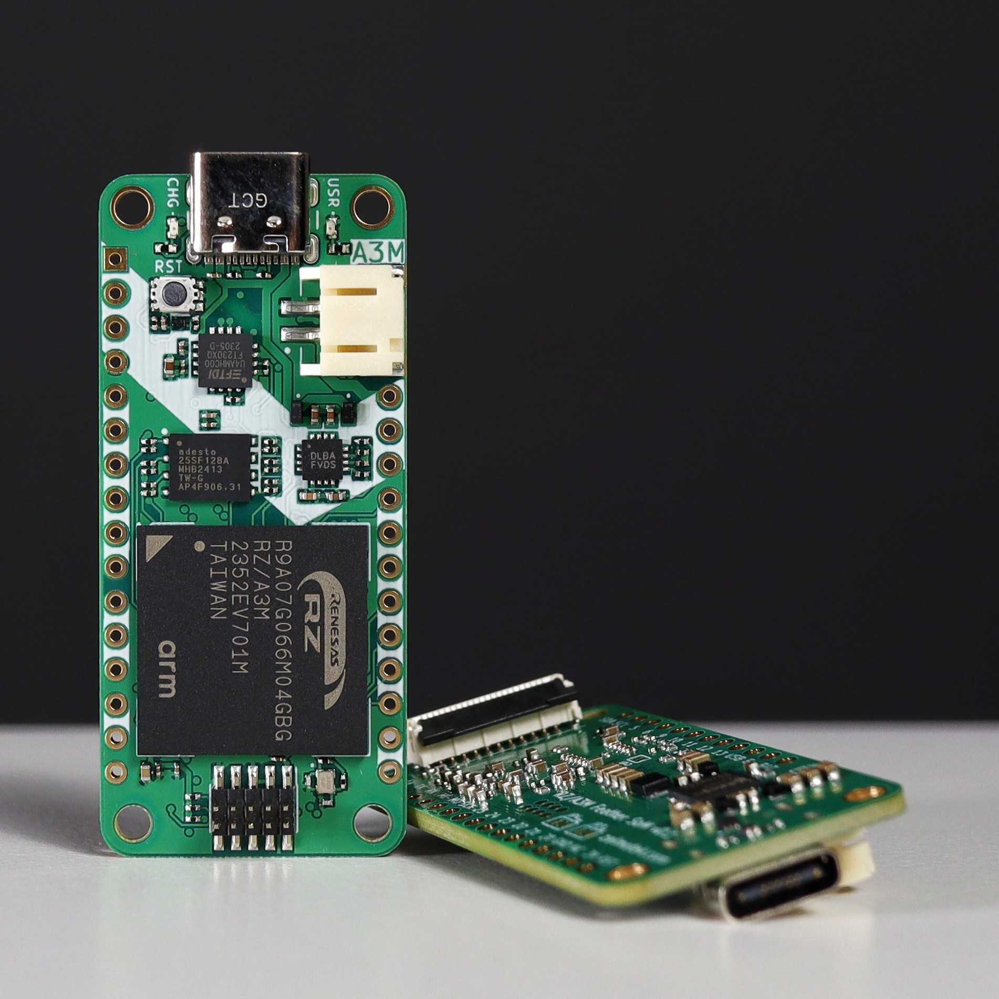

# Introduction

In this tutorial, we will walk you through the steps to set up and get started with the RZ/A3M Feather SoM using the Renesas e² studio Integrated Development Environment. Whether you are a beginner or an experienced developer, this guide will help you understand the basics and get your first project up and running.

## RZ/A3M Feather SoM

The RZ/A3M Feather Board integrates the powerful RZ/A3M microcontroller from Renesas. This board leverages the high performance of the 64-bit Arm® Cortex®-A55 CPU core with a maximum frequency of 1 GHz, allowing it to achieve the full potential of a real-time operating system (RTOS). The Feather Board includes classic features such as GPIOs (analog and digital), I2C and SPI communication pins, UART pins, a LiPo battery power plug, and a USB programming port. With support for multiple communication interfaces, including USB, Ethernet, CAN, and various serial communications, the RZ/A3M Feather Board offers flexibility for connecting to a wide range of devices, making it ideal for IoT, industrial automation, and robotics applications.  
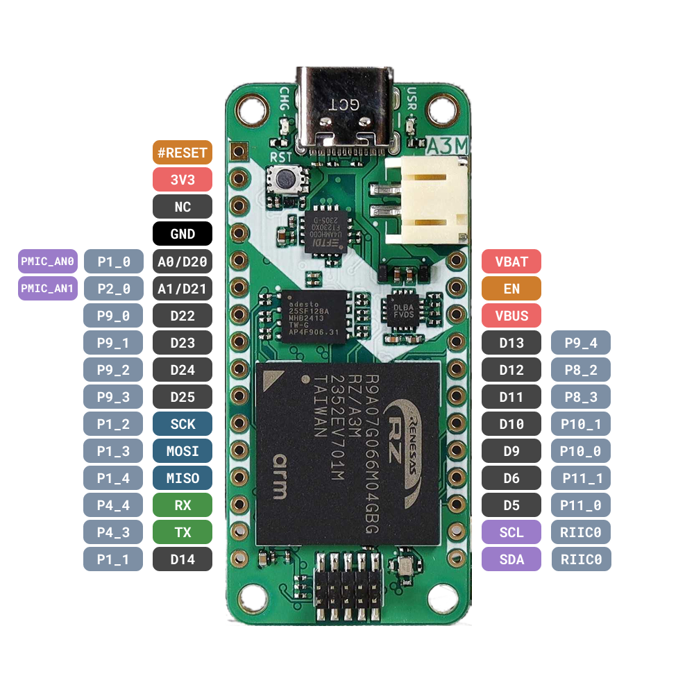  
*RZ/A3M Feather SoM pinout*

*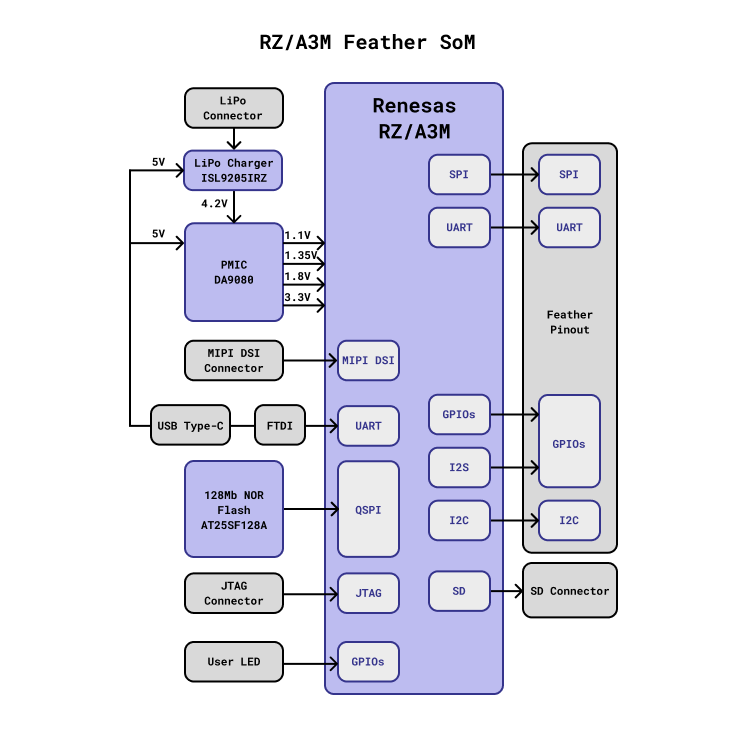*  
*RZ/A3M Feather SoM block diagram*

# Installing Renesas e² studio IDE

The e² studio IDE from Renesas is a comprehensive, user-friendly platform designed to streamline embedded application development. It supports Renesas microcontrollers, including the RZ/A3M, and combines powerful features with an intuitive coding, debugging, and project management interface. 

First of all, download the latest release of the Flexible Software Package with the e²studio platform installer from the following link, according to your OS: [https://www.renesas.com/us/en/software-tool/e2studio-information-rz-family](https://www.renesas.com/us/en/software-tool/e2studio-information-rz-family) 

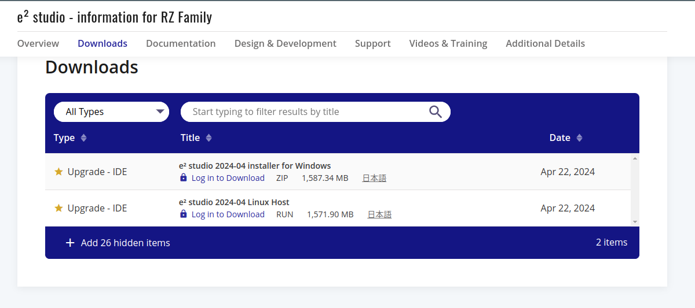

The installer will guide you through the necessary steps. After the installation is finished, launch Renesas e² studio and set up your workspace. This will be the directory where all your projects will be stored.

You will also need to install the [J-Link Software pack](https://www.segger.com/products/debug-probes/j-link/technology/flash-download/).

# Hardware Setup

Connect the Feather board to your PC using the USB-C cable, and connect the J-Link debugger's ribbon cable to the RZ/A3M Feather. Also connect the micro-USB cable to the J-link and the other end to your PC, as shown below:

# Software Setup

To use the RZ/A3M Feather SoM we need to download the [**internal**](https://github.com/Zalmotek/RZA3UL-feather-som-firmware-samples/tree/main/internal) folder. After that in e2studio in the **Help** menu select **About e2studio**, open **Installation Details** \-\> **Support Folders**, then select **e2studio support area** and paste the **internal** folder there.

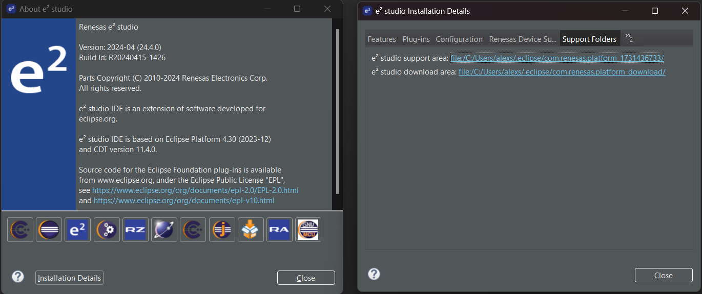

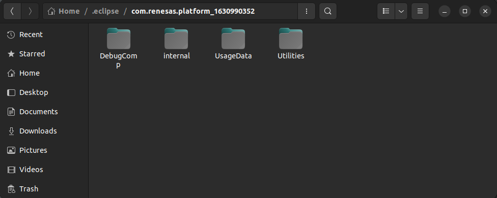

## Creating a project from scratch

For a better understanding of the e2studio functionalities, consult the [Renesas guide](https://www.renesas.com/us/en/document/apn/rza-getting-started-flexible-software-package?r=1625071). We will start by creating a new project. Select RZ/A FSP Project, choose a name, and select the device and tool configuration as in the picture below.

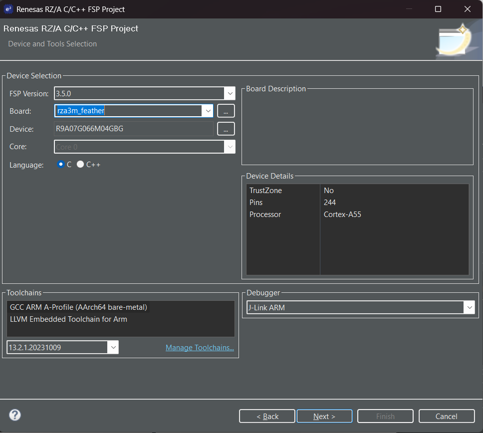

After that, right-click on your project \-\> **C/C++ Project Settings** \-\> **C/C++ Build** \-\> **Settings** \-\> **Cross ARM C++ Linker** \-\> **General**.

Change script file to: **${workspace\_loc:/${ProjName}/script/custom.ld}**

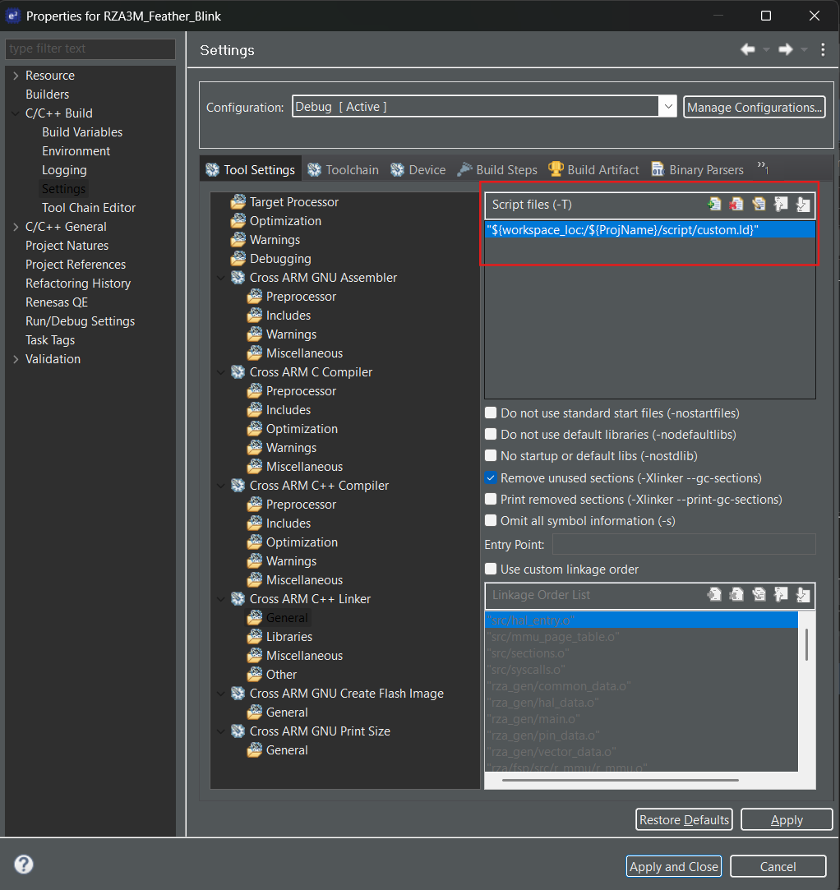

To test the sample after finishing the code and configuration, click **Generate Project Content** and then the **Build** button. Before debugging, the following settings will be made: In **Debugger** \-\> **Connection Settings** \-\> **Connection** \-\> **Reset after download**.

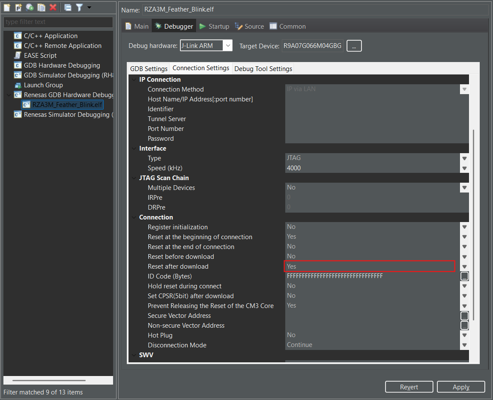

After that in **Startup** we have to make the following settings: change the **Load type** field of **Program Binary** from **Image and Symbols** to **Symbols only**.

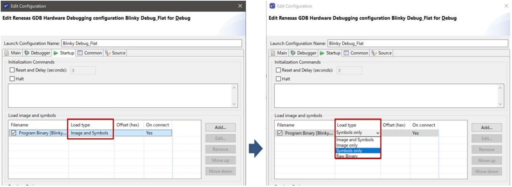

Finally, link the files with the .**srec** extension from **Ipl** and **Debug** files, **Apply** the settings, and then press **Debug**.

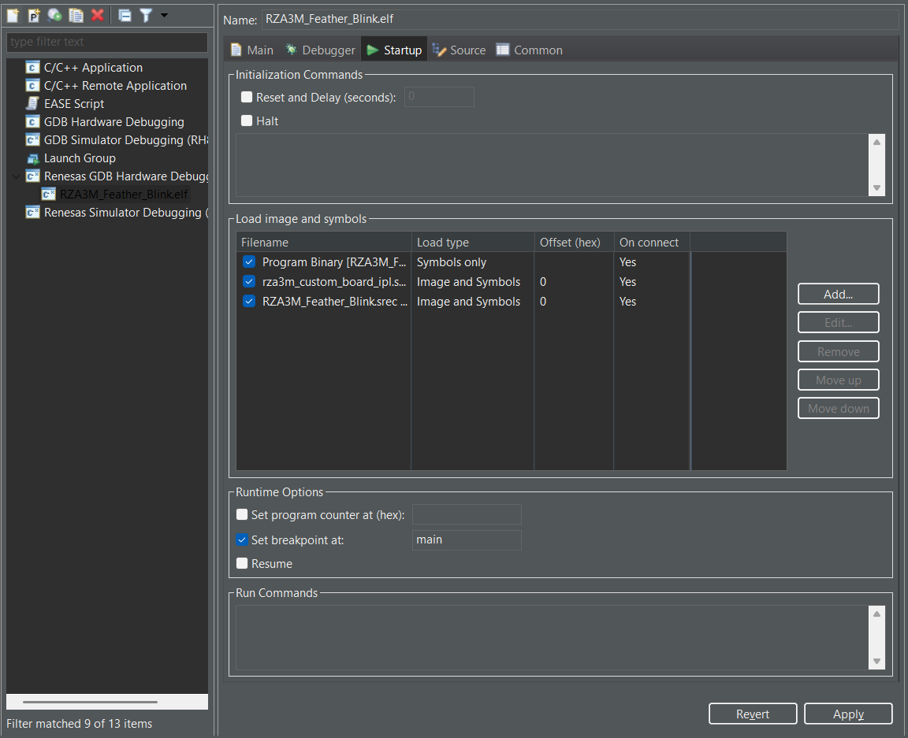

## Running the Blink project

Download the Blink sample from [here](https://github.com/Zalmotek/RZA3UL-feather-som-firmware-samples/blob/main/RZA3UL_Feather_Blink.zip). 

In e2studio go to **File** \-\> **Open Projects** **from File System**, choose **Archive** and browse to the project you’ve just downloaded, then click **Finish**:

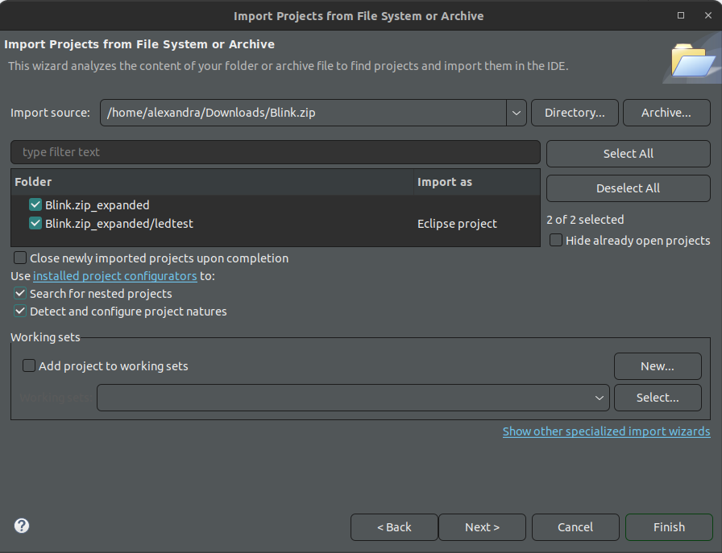  

In the newly imported project click the **configuration.xml** file to open the configurator. To run the project, click **Generate Project Content,** and then you can **Build** the project and **Debug** it. In the prompt that pops up, choose **Debug as Renesas GDB Hardware Debugging.** Click the **Resume** icon to begin executing the project. Reset the board and now the USR LED should be blinking.

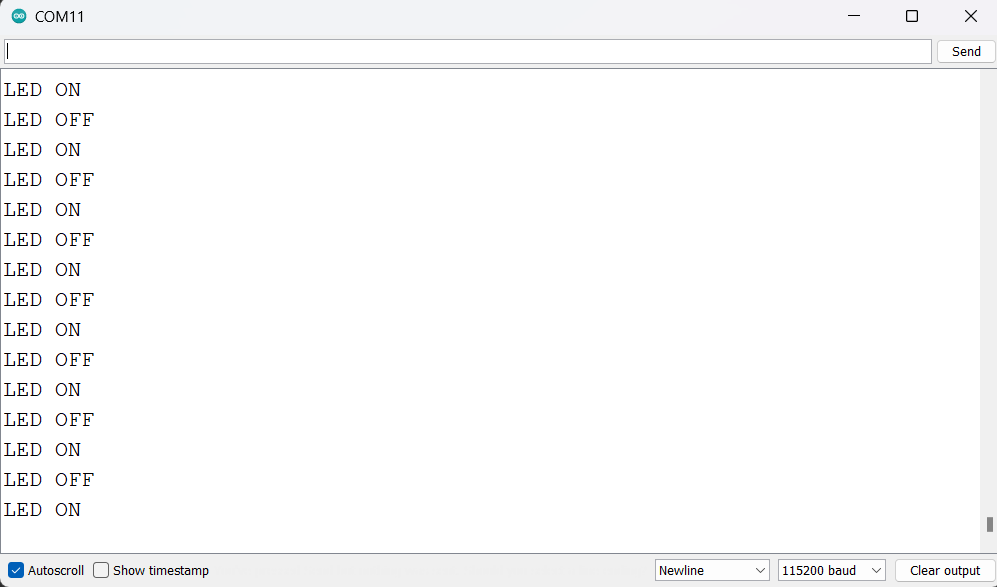

## Flashing the firmware using JFlash Lite

The SREC file format was developed by Motorola to simplify the deployment of programs as binary information in hexadecimal values to targets, without needing to compile and prepare the source files in an IDE. An alternative method to flash the firmware without e2studio is to use the J-Flash Lite tool. To do this, select the device as **R9A07G066M04GBG**, choose the **JTAG** interface, and set the speed to **4000** kHz. You can find the necessary **.srec** file for flashing in the **Debug** folder of the project archive.

## 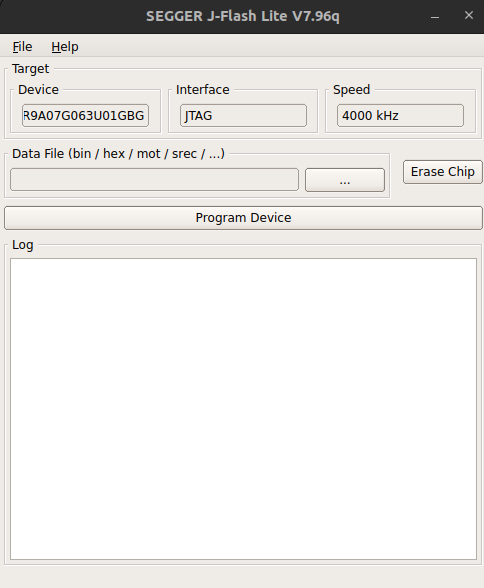
